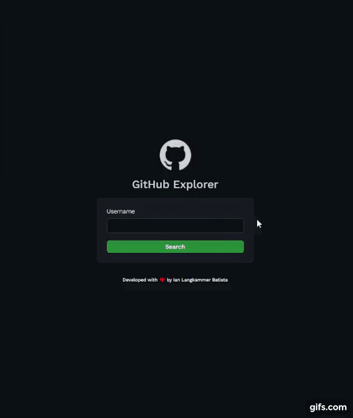
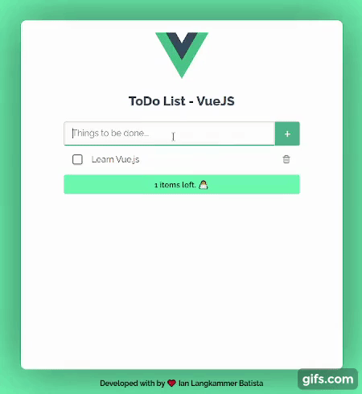
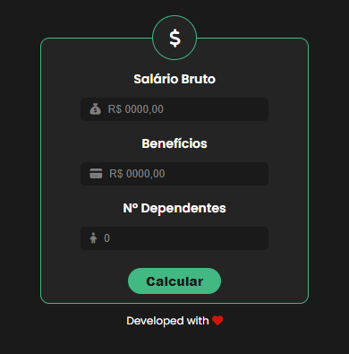

<div align="center">

# Ian Langkammer

**Desenvolvedor de software** · Belo Horizonte, MG

Construo produtos web e mobile com foco em TypeScript, boa UX e código que envelhece bem.

<br />

[](https://ianlgnk.github.io/ianlgnk/)
[](https://linkedin.com/in/ianlgnk)
[](https://lattes.cnpq.br/7938181587174261)
[](mailto:ianlgnk@gmail.com)

</div>

<br />

## Sobre mim

Trabalho com ecossistema **React** (web e mobile), **Node**, **TypeScript** e integrações em nuvem. Gosto de interfaces responsivas, acessibilidade e detalhes que fazem a diferença no dia a dia de quem usa o produto.

Este repositório é o **código-fonte do meu portfólio** — o mesmo projeto que aparece no meu perfil do GitHub.

<br />

## Projetos da faculdade

Referência aos repositórios que fui construindo na graduação. GIFs e capturas de demonstração estão em [`public/college-projects/`](public/college-projects/) (servidos pelo site e reutilizados aqui no README).

| Repositório | Notas |
| :--- | :--- |
| [**atelie-da-gisa**](https://github.com/ianlgnk/atelie-da-gisa) | SPA de vendas de macramê; Next.js, Firebase, UI com shadcn. |
| [**tcc**](https://github.com/ianlgnk/tcc) | Front-end do TCC (Vite, TypeScript); deploy Firebase. |
| [**tcc-cloudfunctions**](https://github.com/ianlgnk/tcc-cloudfunctions) | Cloud Functions (TypeScript) associadas ao TCC. |
| [**pandafilmes-frontend**](https://github.com/ianlgnk/pandafilmes-frontend) | Catálogo de filmes com Vue, Vuetify, Vue Router e Vuex. |
| [**shot_in_fly**](https://github.com/ianlgnk/shot_in_fly) | Jogo em Java (JDK 8) com sockets e threads (cliente/servidor). |
| [**cassandra-project**](https://github.com/ianlgnk/cassandra-project) | Exploração do Cassandra (NoSQL); front Vue e API em Node. |
| [**social4devs-frontend**](https://github.com/ianlgnk/social4devs-frontend) | Rede social para devs — Vue 3, TypeScript, Naive UI. |
| [**clt-pj-converter**](https://github.com/ianlgnk/clt-pj-converter) | Conversor salário CLT → PJ (Vue 3 + TypeScript); [demo](https://converter-clt-pj.netlify.app/). |
| [**insertion-sort_assembly**](https://github.com/ianlgnk/insertion-sort_assembly) | Insertion sort em Assembly (UFOP — Organização de Computadores). |
| [**github-profile-explorer**](https://github.com/ianlgnk/github-profile-explorer) | Busca de utilizadores GitHub (React + TypeScript + API); [demo](https://githubexplorer-ianlgk.netlify.app/). |
| [**guess-the-number**](https://github.com/ianlgnk/guess-the-number) | Adivinha o número (React); [demo](https://guess-the-number-ianlgk.netlify.app/). |
| [**todo-list**](https://github.com/ianlgnk/todo-list) | To-do com Vue e `localStorage`; [demo](https://todo-list-ianlgk.netlify.app/). |
| [**snake-fila**](https://github.com/ianlgnk/snake-fila) | Snake em C com lógica de fila (trabalho de AEDS — UFOP). |

<details>
<summary><b>Pré-visualizações</b> (GIF / imagem)</summary>

<p align="center">
  <b>GitHub Profile Explorer</b><br />
  <a href="https://github.com/ianlgnk/github-profile-explorer"></a>
</p>

<p align="center">
  <b>Guess the Number</b><br />
  <a href="https://github.com/ianlgnk/guess-the-number"></a>
</p>

<p align="center">
  <b>To-do List</b><br />
  <a href="https://github.com/ianlgnk/todo-list"></a>
</p>

<p align="center">
  <b>Conversor CLT → PJ</b><br />
  <a href="https://github.com/ianlgnk/clt-pj-converter"></a>
</p>

</details>

<br />

## Stack

| Tecnologia | Papel no projeto |
| :--- | :--- |
| **React 19** | UI em componentes; seções do site (Hero, About, Experience, Projects, Skills, Contact). |
| **TypeScript** | Tipagem estática em dados, mensagens i18n e props dos componentes. |
| **Vite 8** | Dev server, HMR e build de produção para `dist/`. |
| **Tailwind CSS** | Estilos utilitários, tema claro/escuro e layout responsivo. |
| **Framer Motion** | Animações de entrada, transições e microinterações. |
| **Radix UI** | Primitivos acessíveis (ex.: `Slot` no botão). |
| **EmailJS** | Envio do formulário de contato no browser (variáveis `VITE_EMAILJS_*`). |
| **GitHub Actions** | CI: instala dependências, build e publicação no GitHub Pages. |

<p align="left">
  
  
  
  
  
</p>

<br />

## Desenvolvimento local

**Requisito:** [Node.js 22](https://nodejs.org/) (ver `.nvmrc` e `engines` no `package.json`).

```bash
git clone https://github.com/ianlgnk/ianlgnk.git
cd ianlgnk
yarn install
cp .env.example .env   # opcional: formulário de contato (EmailJS)
yarn dev
```

O app sobe em **http://localhost:5173** com `base` em `/` (padrão do Vite).

Para testar o build como no GitHub Pages (assets em `/ianlgnk/`):

```bash
VITE_BASE_PATH=/ianlgnk/ yarn build
yarn preview
```

Variáveis no `.env` (ver `.env.example`):

| Variável | Uso |
| :--- | :--- |
| `VITE_EMAILJS_PUBLIC_KEY` | Chave pública do EmailJS |
| `VITE_EMAILJS_SERVICE_ID` | ID do serviço |
| `VITE_EMAILJS_TEMPLATE_ID` | ID do template (`from_name`, `from_email`, `message`) |

<br />

## Build e deploy

O workflow [`.github/workflows/deploy.yml`](.github/workflows/deploy.yml) roda em cada **push na `main`**:

1. **Checkout** do repositório e **Node 22** (cache do Yarn).
2. **`yarn install --frozen-lockfile`** e gravação do `.env` a partir do secret **`ENV`** (variáveis do EmailJS em produção).
3. **`yarn build`** com `VITE_BASE_PATH=/ianlgnk/` — o Vite gera `dist/` com caminhos corretos para o subpath do GitHub Pages.
4. **Upload** do artefato e **deploy** no ambiente `github-pages`.

Site publicado: **https://ianlgnk.github.io/ianlgnk/**

Comandos úteis localmente:

```bash
yarn build    # tsc -b && vite build
yarn lint     # ESLint
yarn preview  # serve a pasta dist/ após o build
```

<br />

## GitHub

<p align="left">
  <a href="https://github.com/ianlgnk?tab=repositories">
    
  </a>
  
</p>

<br />

<div align="center">

*Obrigado por passar por aqui — se quiser trocar uma ideia, chama no [LinkedIn](https://linkedin.com/in/ianlgnk) ou no [e-mail](mailto:ianlgnk@gmail.com).*

</div>
